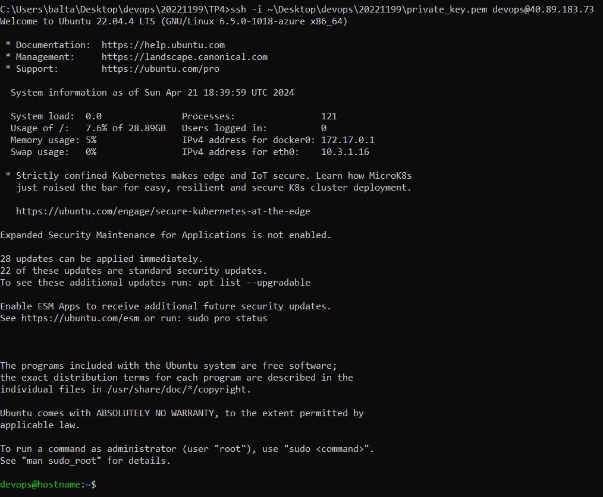
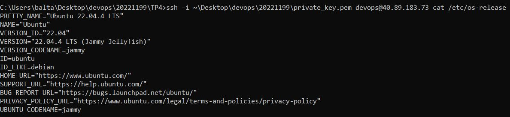
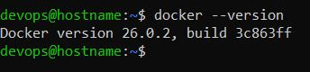

# README - TP4 - Création d'une machine virtuelle Azure avec Terraform

Dans ce TP, l'objectif est de créer une machine virtuelle (VM) Azure avec une adresse IP publique dans un réseau existant à l'aide de Terraform. On cherche à se connecter à la VM via SSH et comprendre les différences entre les services Azure Container Instances (ACI) et Azure Virtual Machines (AVM).

## 1. Choix technique
Terraform : Terraform est un outil open-source qui permet de gérer l'infrastructure de manière code, en utilisant une approche déclarative. Il permet aux équipes de décrire leur infrastructure cloud dans des fichiers de configuration simples et lisibles, offrant ainsi la possibilité de provisionner et de gérer des ressources sur divers fournisseurs cloud, tout en garantissant la reproductibilité, la cohérence et la facilité de gestion des environnements.

## 2. Installation de terraform
Pour débuter, j'ai installé Terraform sur mon environnement local, suivant les instructions spécifiques à mon système d'exploitation.

## 3. Connexion à Azure
J'ai initié la connexion à Azure en utilisant la commande ```az login``` dans mon terminal. Cette commande m'a permis de m'authentifier auprès de mon compte Azure et d'établir une session de travail valide, ce qui est essentiel pour que Terraform puisse interagir avec les services Azure lors du déploiement de l'infrastructure. Une fois cette configuration effectuée, j'ai pu entamer la création de mon infrastructure cloud via Terraform.

## 4. Configuration de l'infrastructure
Pour déployer mon infrastructure Azure avec Terraform, j'ai d'abord configuré les fichiers Terraform (selon les contraintes) nécessaires pour décrire mon environnement cloud. Voici une explication détaillée de chaque fichier et de son rôle dans le processus de déploiement :

### main.tf : 
Configure le fournisseur AzureRM pour utiliser l'abonnement Azure spécifié. La ligne ```subscription_id = var.subscription_id``` définit l'ID de l'abonnement à utiliser, tandis que ```skip_provider_registration = true désactive``` l'enregistrement automatique du fournisseur dans Azure. Cela permet à Terraform d'interagir avec les ressources Azure lors du déploiement de l'infrastructure.

### variables.tf : 
Ce fichier définit des variables utilisées dans notre configuration Terraform pour paramétrer l'infrastructure Azure. Chaque variable est décrite par sa fonction, son type et sa valeur par défaut. 

### virtual_machine.tf : 
Ce bloc de configuration spécifie les détails nécessaires pour créer et configurer une machine virtuelle Linux dans Azure, en incluant des paramètres tels que la localisation, la taille, le système d'exploitation, et les configurations d'authentification.

### data.tf : 
Ce fichier permet à Terraform de récupérer les détails du réseau virtuel et du sous-réseau existants dans Azure, afin de les utiliser dans la configuration de notre infrastructure sans avoir besoin de les recréer manuellement.

### network.tf : 
Ce fichier permet de créer une interface réseau avec une adresse IP publique dans Azure. L'interface réseau est configurée pour être attachée à un sous-réseau spécifié, avec une adresse IP privée allouée dynamiquement, et une adresse IP publique associée pour permettre l'accès depuis Internet.


Les contraintes spécifiées ont été rigoureusement respectées lors du déploiement de l'infrastructure Azure avec Terraform. En respectant ces contraintes, l'infrastructure déployée est alignée sur les normes et les spécifications requises pour le projet. Je rappelle les essentielles ici : 
* Location : france central
* VM size : Standard_D2s_v3
* User administrateur de la VM : devops
* OS : Ubuntu 22.04
* Network : network-tp4
* Subnet : internal


## 5. Création de la clef SSH avec Terraform avec ```ssh.tf```
Dans cette section, j'utilise Terraform pour générer une paire de clés SSH privée/publique. Tout d'abord, on définit la ressource tls_private_key, spécifiant l'algorithme RSA et une longueur de clé de 4096 bits. Ensuite, on a deux sorties pour récupérer les clés générées. L'output private_key_pem contient la clé privée au format PEM, tandis que l'output public_key_openssh contient la clé publique au format OpenSSH. Ces clés peuvent ensuite être utilisées pour l'authentification SSH lors de la configuration et de la gestion des ressources dans mon infrastructure.

## 6. Déploiement de l'infrastructure

### Initialisation du répertoire Terraform
Dans le répertoire contenant mes fichiers Terraform, je lance la commande suivante pour initialiser le répertoire et télécharger les plugins nécessaires :
```bash
terraform init
```
### Vérification de la planification
J'utilise la commande suivante pour vérifier les changements proposés par Terraform. Je m'assure que les ressources qui seront créées correspondent à mes attentes et respectent les contraintes spécifiées.
```bash
terraform plan
``` 
### Application des changements et déploiement de l'infrastructure
Si la planification est conforme à mes attentes, je lance la commande suivante pour appliquer les changements et déployer l'infrastructure Azure : (Terraform demandera de confirmer l'application des changements avant de procéder) : 
```bash
terraform apply
```

## 7. Récupération de la clé privée
On exécute la commande suivante pour afficher la sortie de la clé privée SSH générée dans le fichier Terraform et l'enregistrer localement pour se connecter à la VM : 
```bash
terraform output private_key_pem
```

## 8. Connexion à la machine virtuelle
Pour se connecter à la machine virtuelle après son déploiement, on récupère l'adresse IP publique. Cette adresse sera affichée dans le résumé des ressources créées ou alors disponible sur Azure dans les propriétés de la ressource créée. Ensuite, on utilise la commande SSH suivante en spécifiant le chemin vers la clé privée (-i) et l'utilisateur administrateur de la machine virtuelle (devops). On remplace 40.89.183.73 par l'adresse IP publique de notre machine virtuelle : 
```bash
ssh -i id_rsa devops@40.89.183.73
```
Ceci vous connectera à la VM en local.



## 9. Commande pour la notation

```bash
ssh -i id_rsa devops@40.89.183.73
```


## 10. Nettoyage des ressources
On peut supprimer toutes les ressources déployées en exécutant la commande : 
```bash
terraform destroy
```

## 10. Bonus
### 1. Installation de Docker avec Cloud-init
Dans cette tâche supplémentaire, j'automatise l'installation de Docker dès le démarrage de ma machine virtuelle en utilisant Cloud-init.
```bash
custom_data = base64encode(<<-EOF
                #!/bin/bash
                sudo apt-get update
                sudo apt-get install -y apt-transport-https ca-certificates curl software-properties-common
                curl -fsSL https://download.docker.com/linux/ubuntu/gpg | sudo apt-key add -
                sudo add-apt-repository "deb [arch=amd64] https://download.docker.com/linux/ubuntu $(lsb_release -cs) stable"
                sudo apt-get update
                sudo apt-get install -y docker-ce
                EOF
  )
```


### 2. Élimination de la duplication de code grâce à l'utilisation de variables
Je me concentre sur la réduction de la duplication de code en utilisant des variables Terraform. Plutôt que de répéter les mêmes valeurs à plusieurs endroits dans ma configuration, je centralise ces valeurs dans des variables que je référence ensuite dans tout mon code. Cette approche rend mon code plus concis, plus lisible et plus facile à maintenir.

### 3. Formatage correct du code Terraform
Je veille à maintenir une présentation uniforme et lisible de mon code Terraform en utilisant la commande ```terraform fmt```. Cette commande me permet de formater automatiquement mon code selon des conventions prédéfinies, favorisant ainsi la cohérence et facilitant la collaboration au sein d'une équipe.